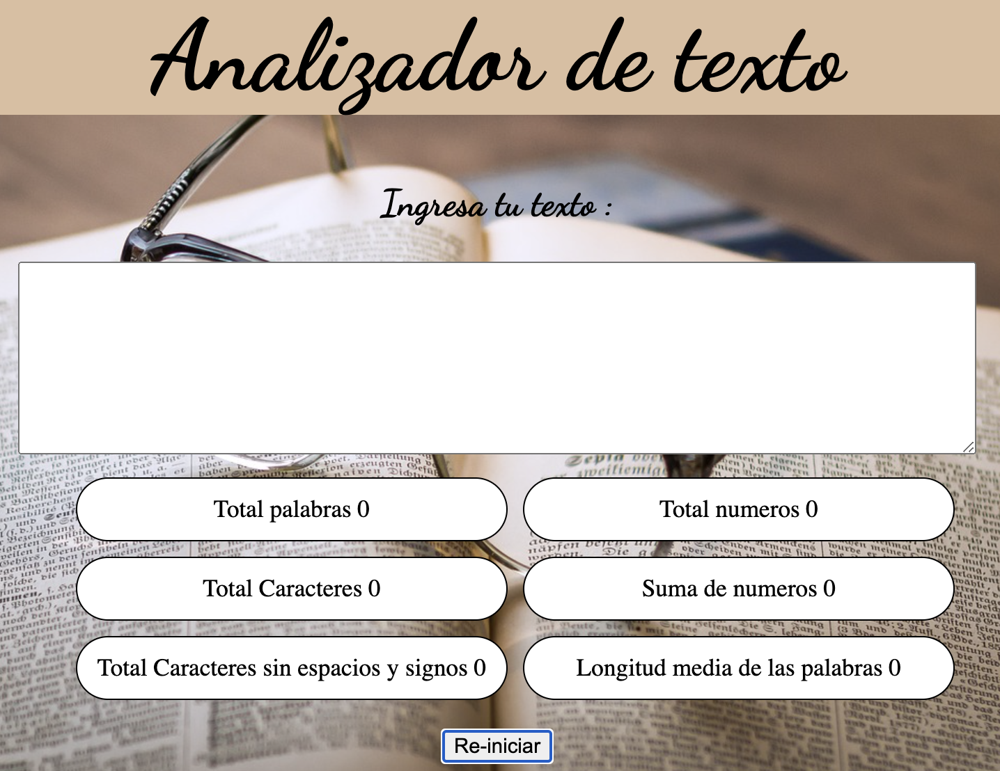

# README

# Analizador de texto 📑

## Índice

---

## 1. Resumen del Proyecto.

En este proyecto se creo una aplicación web que sirve para analizar un texto en el navegador mostrando una serie de indicadores y métricas específicas sobre caracteres, letras, números, etc. Que hayan sido enviadas como *input* por una persona. Esto se hizo utilizando HTML, CSS y JavaScript.

## 2. Preámbulo

Un analizador de texto es una aplicación para extraer información útil de un texto utilizando diversas técnicas, como el procesamiento del lenguaje natural (NLP), el aprendizaje automático (ML) y el análisis estadístico. Estas aplicaciones pueden proporcionar una variedad de métricas que brindan información básica sobre la longitud y la estructura del texto como por ejemplo, el conteo de palabras, el conteo de caracteres, el conteo de oraciones y el conteo de párrafos. Otras métricas incluyen el análisis de sentimientos, que utiliza técnicas de NLP para determinar el tono general positivo, negativo o neutral del texto, y el análisis de legibilidad, que utiliza algoritmos para evaluar la complejidad y la legibilidad del texto.

En general, las aplicaciones de análisis de texto brindan información valiosa y métricas sobre los textos que pueden ayudar a las usuarias a tomar decisiones informadas y sacar conclusiones significativas. Mediante el uso de estas herramientas de análisis, las usuarias pueden obtener una comprensión más profunda de los textos.

## 3. Funcionalidades

El listado de funcionalidades es el siguiente:

1. La aplicación permite al usuari@ ingresar un texto escribiéndolo en un cuadro de texto.
2. La aplicación calcula las siguientes métricas y actualiza el resultado en tiempo real a medida que el usuari@ escribe su texto:
    - **Recuento de palabras**: la aplicación puede contar el número de palabras en el texto de entrada y muestra este recuento al usuari@
    - **Recuento de caracteres**: la aplicación puede contar el número de caracteres en el texto de entrada, incluidos espacios y signos de puntuación, y muestra este recuento al usuari@.
    - **Recuento de caracteres excluyendo espacios y signos de puntuación**: la aplicación puede contar el número de caracteres en el texto de entrada, excluyendo espacios y signos de puntuación, y muestra este recuento al usuari@.
    - **Recuento de números**: la aplicación puede contar cúantos números hay en el texto de entrada y muestra este recuento a la usuaria.
    - **Suma total de números**: la aplicación suma todos los números que hay en el texto de entrada y muestra el resultado a la usuaria.
    - **Longitud media de las palabras**: la aplicación calcula la longitud media de las palabras en el texto de entrada y se lo muestra al usuari@.
3. La aplicación permite limpiar el contenido de la caja de texto haciendo clic en un botón.

## 5. **Construido con 🛠️**

- [Visual Code Studio](https://code.visualstudio.com/) - Code editor
- [Nodejs](https://nodejs.org/es) - Open-source, cross-platform JavaScript runtime environment

## 6. Autor

- **Isis Marina Daza Peña** -*Trabajo Inicial* - [Isis Daza](notion://www.notion.so/README-23889c319c50443aa73b786797b1bda0#isis-daza)

## 7. Agradecimientos 🎁

- Al equipo de Coaches de Laboratoria que siempre estuvieron presentes para aclarar cualquier duda presentada.
- A mis compañeras de Squad por compartir sus ideas y conocimiento adquirido en este camino .